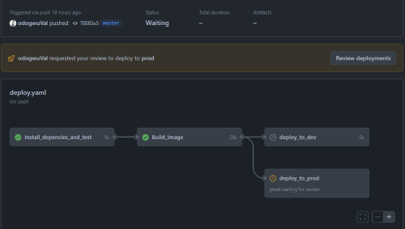

# Deployment strategy
This is a very basic node js application that displays "Hello world"

A continuous integration and continuous deployment (CI/CD) pipeline is a series of steps that must be performed in order to deliver a new version of software. CI/CD pipelines are a practice focused on improving software delivery throughout the software development life cycle via automation. 

By automating CI/CD throughout development, testing, production, and monitoring phases of the software development lifecycle, organizations are able to develop higher quality code, faster. Although it’s possible to manually execute each of the steps of a CI/CD pipeline, the true value of CI/CD pipelines is realized through automation.

I have created a CI/CD pipeline using github action because of its seamingly simplicity with regards to our use case.
The deployment phase involvs packaging the aplication in a docker image and deploying using docker-compose.
I have leveraged Github environments to dynamically require manual approval for deployment to production.
When a change is made to the dev branch, the entire process is automated but a change to the master branch will require a manual approval for deployment to occur

